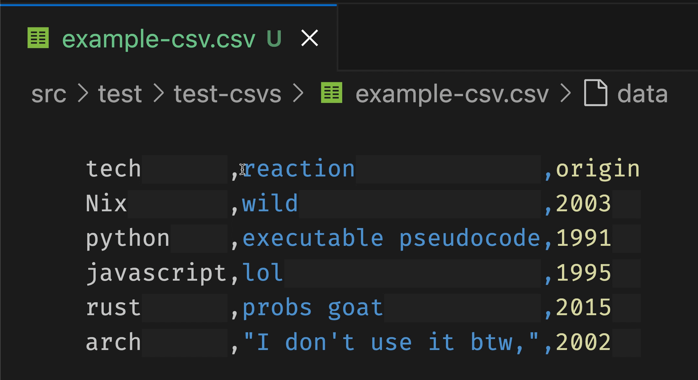

A VSCode extension that uses the inlay hints to
render csvs as columns.


**Tip: We recommend that this is used with the rainbow csv extension, which will color the columns.**

A CSV like this:

```csv
grant,murphy,whaddup,1234,dog
d-train,mochi,hi,1,kitten
```

Would be rendered like this:

```csv
grant  ,murphy,whaddup,1234,dog
d-train,mochi ,hi     ,1   ,kitten
```

## Features

### Deleting Columns



## [To Do / Known Issues](https://github.com/GSmithApps/csv-aligner/issues)

- [It doesn't handle separators other than commas](https://github.com/GSmithApps/csv-aligner/issues/3)

## Release Notes

### 0.2.0

- It works for bigger files now

### 0.1.1

- Added a gif and features section to the readme.

### 0.1.0

Solved [top issue](https://github.com/GSmithApps/csv-aligner/issues/1),
we think it's working with commas in cell values now.

It doesn't seem to handle different separators very well.
That's in progress.

### 0.0.9

Experimenting with CICD in github.

### 0.0.8

VSCode was updated and the
default inlay hint truncation
was removed

### 0.0.7

Enhanced README

### 0.0.6

Lol put in an icon.

### 0.0.5

Learned that VSCode October 2024 release fixes the inlay hint truncation.
See [VSCode issue 205708](https://github.com/microsoft/vscode/issues/205708).


## Contributors

- Big thanks to [Noé SELLAM](https://github.com/GDGiantDwarf)
  for filing the first issue!!

## Support

If you like CSV Aligner, please consider paying
it forward by taking a pledge at [Giving What We Can](https://www.givingwhatwecan.org/pledge?c=header)
or donating to [GiveWell](https://secure.givewell.org).

Or you support the project directly at PayPal 😄
[](https://paypal.me/GSmithApps?country.x=US&locale.x=en_US)
